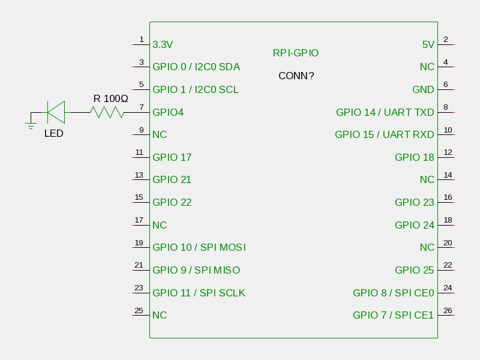

# 概要

Go言語を使用してLEDチカチカをTCP/IPから制御します。

# 準備

## 回路図

以下の回路図のように組み立ててください。



## OSインストール後、1回だけ実施

GPIOを操作するには、Root権限もしくはGPIO権限が必要となります。
この例では、デフォルトユーザであるpiをGPIOグループに所属させることで上記を満たします。

````.bash
$ sudo chmod -aG gpio pi
$ sudo apt-get install git golang gccgo
````

# 実行

````.bash
$ git clone git@github.com:yoshitake-hamano/raspberrypi_golang_webio.git
$ cd raspberrypi_golang_webio
$ gccgo raspberrypi_golang_webio.go
$ ./a.out
````

# LED制御

Raspberry PiのIPアドレスを[Rasp Addr]とすると以下のようにすることでLEDをON/OFFすることが可能です。
HTTPプロトコルのGETを使用しているだけなので、ブラウザからアクセスするだけで制御出来ます。

````.bash
$ wget http://[Rasp Addr]:8000/on
$ wget http://[Rasp Addr]:8000/off
````
